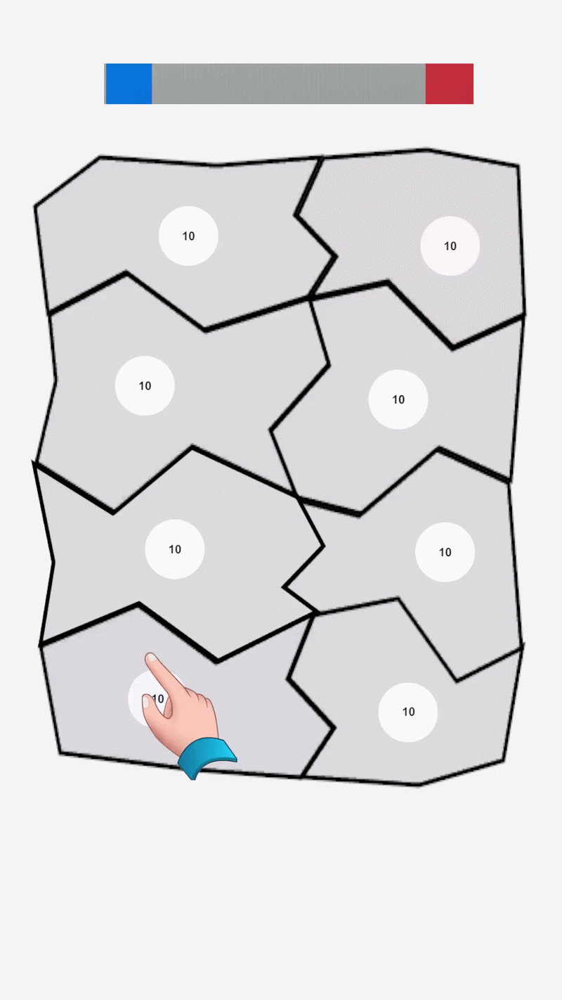

# State.io - Playable Ad Prototype

  

A lightweight playable ad prototype inspired by State.io, built with a strong focus on performance, scalability and mobile web optimization.

## Technical Highlights

• Event-Driven Architecture
Gameplay systems communicate through events, reducing coupling and improving maintainability.

• Object Pooling
Units are recycled instead of instantiated during gameplay to minimize allocations.

• Optimized Collision Logic
Runtime unit interactions use lightweight sqrMagnitude calculations instead of Unity physics.

• ScriptableObject Configuration
Gameplay values are centralized, allowing quick iteration without code changes.

• GC-Friendly Number Cache
Frequently used strings are cached to avoid unnecessary allocations.

• MRAID Ready
JavaScript bridge prepared for MRAID communication, event tracking and store redirection.

## Tech Stack

- Unity
- C#
- WebGL
- MRAID
